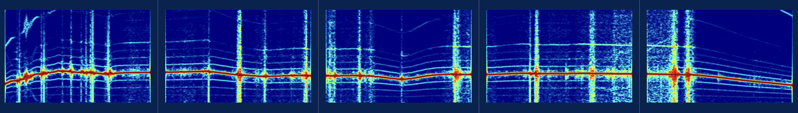
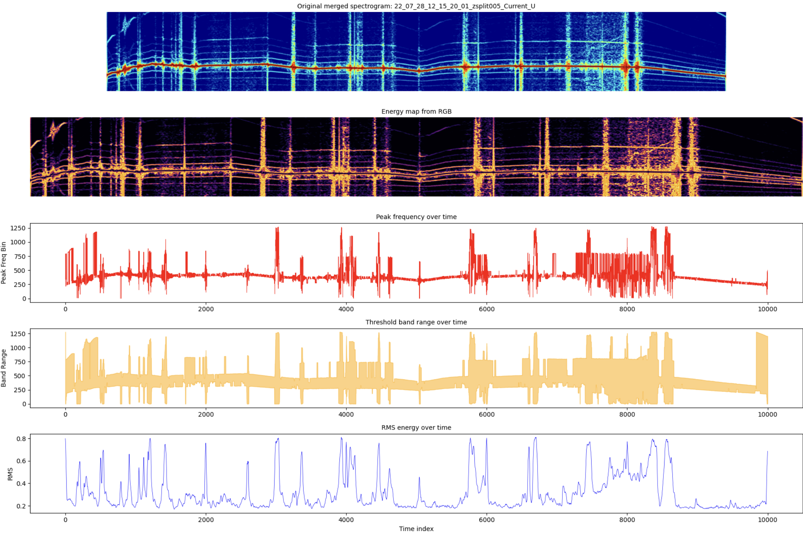

# 2차발표

---

샘플데이터로 가장 중요한 기능이 동작하는지를 보여주기

표지 제외 10페이지 구성

발표시간 10분

# 모터-감속기 데이터 경량화

- png를 시계열 csv로 만듦
- 이런식으로 이어지는 png들은 이어붙임

- 에너지가 상위 10%(90th percentile 임계치 이상)인 픽셀만 "활성 주파수 대역"으로 보고, 아래 4개 피처를 CSV로 저장
    1. 원본 STFT 이미지를 그대로 표시
    2. 컬러 편차 없이 순수 에너지 강도만을 보기 위한 전처리
    3. 각 시간 인덱스(x)에서 에너지가 **가장 큰 단일 주파수 bin**의 위치를 추적한 그래프
    4. 임계치(상위 10%) 이상인 활성 주파수 bin들의 **최솟값(band_start)~최댓값(band_end) 범위**를 면적으로 표시
    5. 각 시간 컬럼의 전체 에너지 크기를 RMS(Root Mean Square)로 계산한 값

Current_U

Vib_Motor

Vib_TM

# Pilot test

- **문제점: 클래스 불균형**
    - 각 클래스마다 png 5개로 일정했는데, 이어지는 png들끼리 합치니 클래스 불균형이 일어남
    - png 하나를 csv로 변환하면 2000행이 나오는데,
    - csv가 1개 있는 클래스는 5개 png가 전부 연속으로 이어져서 2000*5 = 10000행짜리, 4개 있는 클래스는 5개중 2개의 png만 이어져서 4000행짜리 1개 + 2000행짜리 3개
    - 이런식임
    - 

- 해결
    - Pilot 단계에서는 차종 분리X, 통합 학습(나중에 원본데이터로 할때는 분리할 예정)
    -