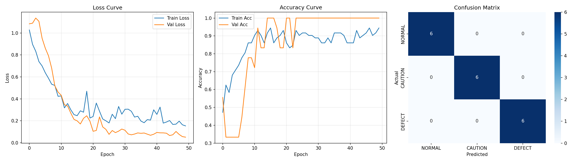

# 4주차  질문모음

날짜: 2026년 3월 30일

### 질문

1. 5주차 개인보고서는 내용이 달라야 하나요 
2. 어떤 llm이 성능이 좋나요 - 클로스 오퍼스 4.6
3. 지원금-얼마인지? 1인당/팀당?
4. 지원금으로 ai 구독 가능한가요?
5. 결국에 우리 하는거는 경량화인데 이걸로도 충분한가요? 하드웨어도 구현도 해야하나요?
6. 데이터가 1테라이다 (55만개, 22만개 모터 배터리 이러한데 ) 외장하드를 사야 할까요? - 대용량 데이터 다운을 어케 하나요?
7. GPU가 필요한 상황인데 코랩 프로를 사는게 맞나요?
8. 솔직히 우리 자동차 쪽으로 취업할거가 아니긴 한데 이걸로 밀고 가도 
9. 파일럿테스트 결과 : 

### 모터감속기

- 자율주행 안전 부품은 **Recall ≥ 0.99** 이상이 목표. 만약에 0.99보다 낮게 나온다 오고 개선이 안된다면 어떻게 해야 하는가?

 1순위는 **Recall ≥ 0.99** 

 2순위는 **Precision 높이기**

train 180개 test 45개

---

### 배터리

1. **데이터 로드**: 폴더 구조에서 npy 파일 + 클래스(NORMAL/CAUTION/DEFECT) 자동 수집
2. **전처리**: 정규화, 패딩/트렁케이션으로 길이 통일, Train/Val 분할
3. **1D CNN 모델**: Conv1D → BatchNorm → ReLU → MaxPool 블록 × 3 → FC → 3클래스 분류
4. **학습**: CrossEntropyLoss + Adam optimizer

train:test = 82:18

---