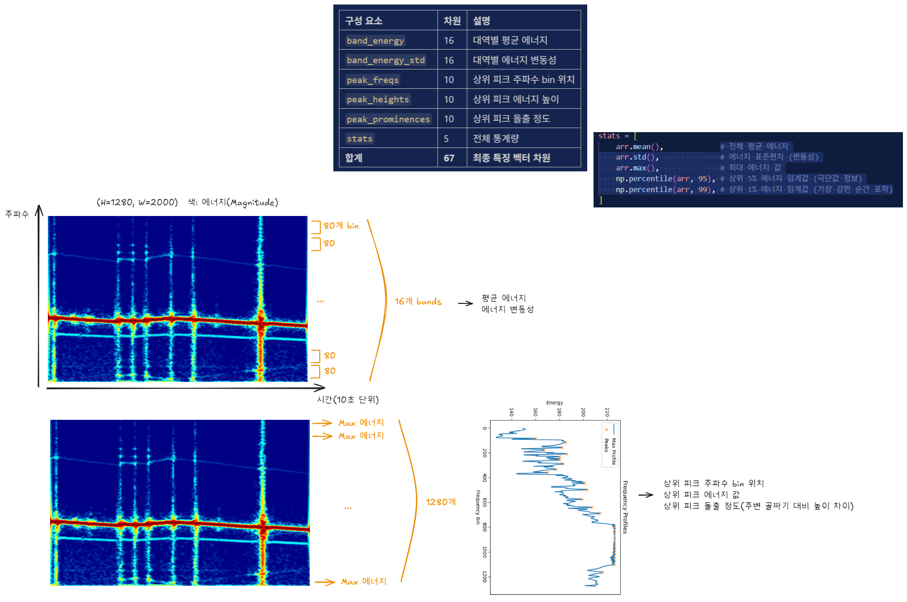

# 8주차 질문 모음

날짜: 2026년 4월 27일

→ 이 데이터를 XGBoost로 분류

- 추론 속도가 매우 빠름 (엣지 배포 친화적, ONNX 변환 가능)
- 특징 중요도(`feature_importances_`)로 **어떤 주파수 대역이 결함 판별에 기여했는지 자동으로 보여줌** → XAI 측면에서 Grad-CAM 대체 가능
- **SHAP values**: 각 예측에 대해 어떤 특징(어떤 주파수 대역)이 기여했는지 계산
- **주파수 도메인 시각화**: SHAP 값을 band energy 위에 색상으로 매핑하면 "이 진단의 근거가 된 주파수 대역"을 히트맵으로 표시 가능

---

### 방법론 설명하고 피드백 받기

1. cnn을 안쓰고 바꾸는 이유? :  **PNG 스펙트로그램**(2000×1280) 으로 고해상 데이터이다.

가장 직관적인 접근은 PNG에 CNN을 적용하는 것이지만, **이미지를 시각적으로 관찰한 결과** 비효율을 발견함.

> **이미지 픽셀의 약 70%가 진한 파랑색(에너지 ≈ 0) 배경이며, 의미 있는 정보는 굵은 빨간 수평 띠와 수직 줄무늬에 집중되어 있습니다.**
> 

### 의사결정에 필요한 것만 입력으로 넣자 → 피쳐 추출

1. 어떤식으로 하냐? 

 

---

교수님 피드백 - 축이 일정하지 않아서 밴드를 잡는데 밴드의 피크값을 잡는다

기계는 정속이므로 동일한 주파수에서 튐 - 운전중이므로 속도에 따라 달라짐

폴리곤을 추가하는 것이 좋을까? - 돌려봐야 알 것 같다 ( 성능 지표 비교를 해보고 할 것 )

처음에는 뽑을 수 있는 최대의 정보를 뽑는 것이 좋을 것 같다.

XG부스트 넣을 것이다 - 피쳐를 만들어서 넣어줘야 하는데 (기존에 논문에서 쓰는 피쳐를 보고 추출)

데이터를 통해 피크값 에너지 값 성분을 추출해야함 - 평균, 이동평균이 중요한지를 

### 기존 논문에서는 어떤식으로 했는지 - 중요하다고 강조한 피쳐 베이스를 잡고

피쳐 가이드를 잡아줘야 함. 

---

샘플데이터는 2~300개로 프로돌려도 괜찮은지  

돌아갈정도로만 베이스라인을 잡을 것.

이해를 풀로 해야 가이드가 나올 것

###