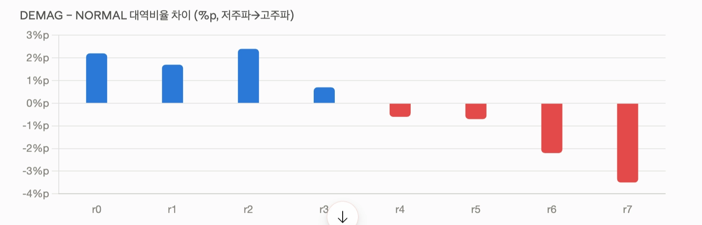

# 방학 - 2주차

날짜: 2026년 8월 1일
할일: DEMAG ↔ NORMAL 오분류 해결

## 진행 상황

- CSV 다시 변환 함
    - 검증결과:

## 주요 발견

- **DEMAG 재분배 실측 확인**: DEMAG−NORMAL 대역비율 차이가
저주파 +2.2%p → 고주파 −3.5%p로 단조 감소. 확장 특징 설계 근거 입증
- **클래스별 rms 중앙값도 분리됨** (예: Current_U DEMAG 0.208 vs NORMAL 0.183)
- **세션 수 충분** → 세션 단위 CV 가능, 확장특징(④) 채택 판정 가능해짐

## 주의 사항

- `band_ratio_7` 0값 비율 5.91% — float16 언더플로우 의심.
고주파 비율이 워낙 작아 일부가 0으로 저장된 것. 학습 진행에는 지장 없고,
④ 판정 시 band_ratio_7 기여도만 보수적으로 해석할 것
- Current_U NaN 4.6% → 학습 코드에서 ffill/bfill 후 0 채움으로 처리 중
- band_end=max 비율 Current_U 25.7%는 전류 신호 특성상 자연스러운 수준

## 다음

- [x]  12ch 베이스라인 학습 (macro-F1: IONIQ 0.896 / KONA 0.884 / NIRO 0.843)
- [x]  2차: +rpm/temp 학습 → NIRO 개선 폭 주목 /
    
    [학습_2-3단계_실행가이드](%ED%95%99%EC%8A%B5_2-3%EB%8B%A8%EA%B3%84_%EC%8B%A4%ED%96%89%EA%B0%80%EC%9D%B4%EB%93%9C%203b08f183f5fb805dbce4f09dd44d27b4.md)
    
- [ ]  3차: +확장특징 학습 → ④ 채택 판정

12채널 결과 돌린거 혼동행렬로 변환

- 니로 운지했음