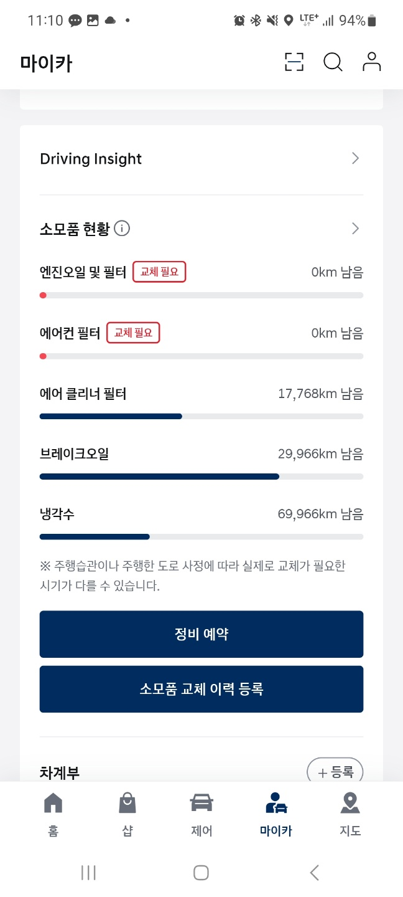
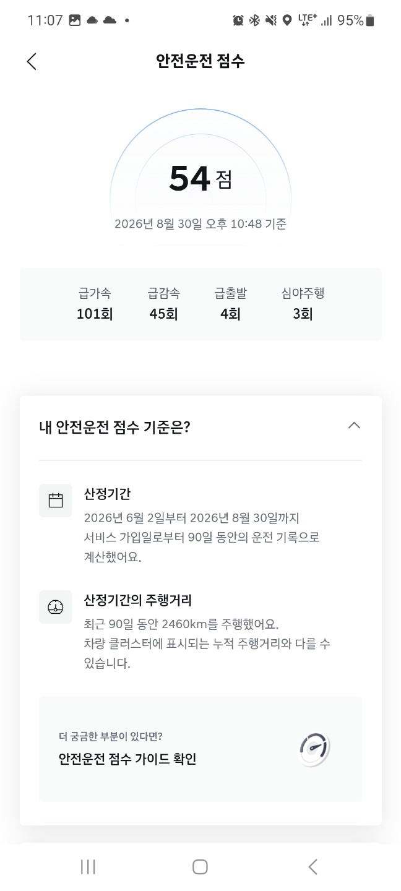
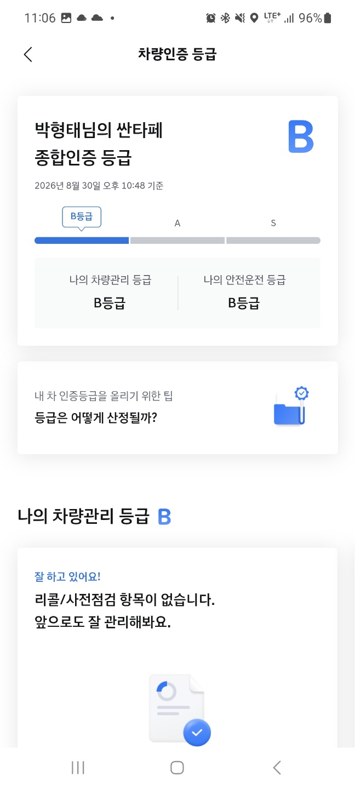
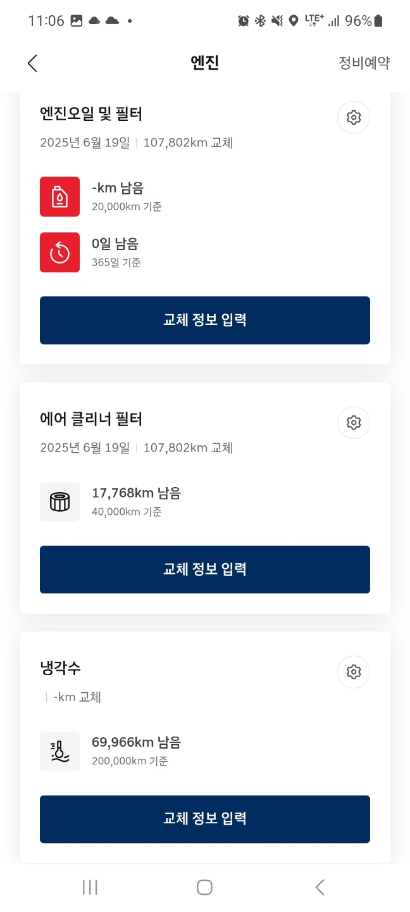
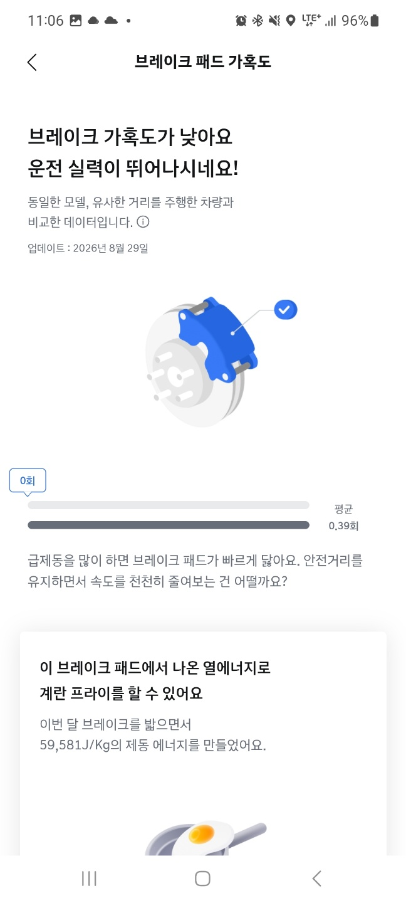
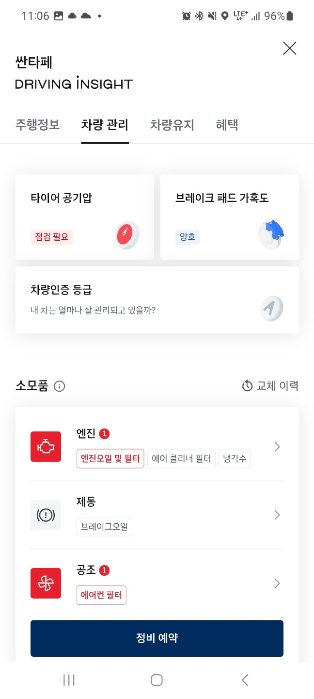
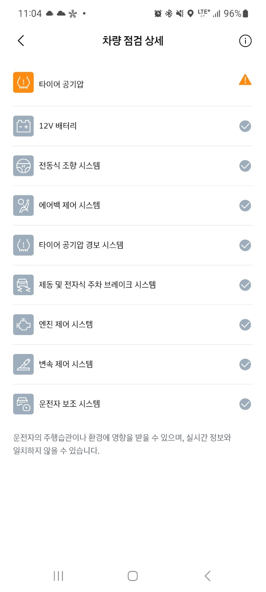

# 방학 - 6주차

날짜: 2026년 8월 30일

하정훈 질문목록

→ 얘네는 왜 여기 가시적인 곳에 모터 상태가 아니래 앱으로 확인할 수 있음.. 왜 그럴까?

차량 내부 화면 (운전대 앞 계기판), 

3번 _ 계기판에는 경고 , 주의, 폐차해라 이런 상태 한단어 또는 아이콘으로 표시

막대로 하는것도 ㄱㅊ은듯

현차 제네시스의 디지털 계기판

IONIQ5

KONA

1번 자리에 뭘 넣기

https://kixxman.com/18-car-warning-lights

옆에 볼 것

세버지: 모터는 잘 모르시지만 , 엔진은 바로 아심

1. 아이콘 색깔 > 엔진 아이콘 국룰 이라면 2번 
2. 글씨 색깔
3. 막대기 

→ 하버지 테스트하기 님 뭐가 좋아 보임?

→ 졸전할때 종이 한장 띡 붙이는게 끝인지 (시연용 노트북이나 아이패드 세팅?)

어플 구현

현대타 블루링크 참고하기

[차량현황 - 블루링크 플릿 | 현대자동차 - 현대닷컴 | 대한민국 대표 자동차회사 hyundai.com](https://www.hyundai.com/kr/ko/digital-customer-support/app/myhyundai/bluelink/bluelink-fleet)

졸전 예시 디스플레이

노트북 화면

vercel

railway: 깃허브에 코드 올리면 배포 (시한부)

