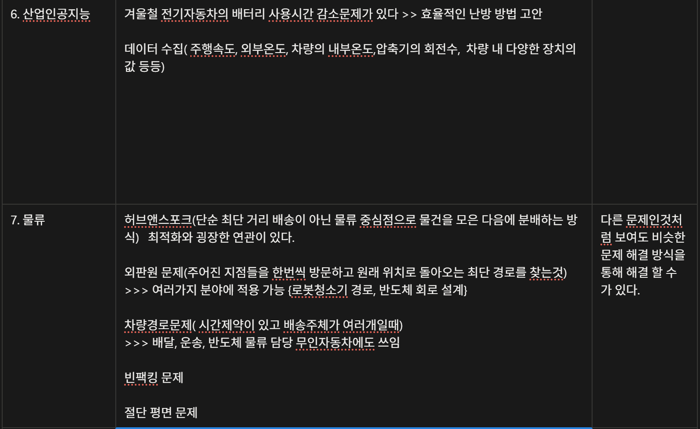

# 주제 정하기

Status: Done

[주제 정리](%EC%A3%BC%EC%A0%9C%20%EC%A0%95%EB%A6%AC%20e3d8f183f5fb82ce8bd4814f40a4fcd3.md)

## 설비 예후 관리(PHM)를 위한 RUL(잔존 수명) 예측 및 고장 원인 진단

NILM이 전력 데이터를 '분해'하는 것이라면, PHM(Prognostics and Health Management)은 산업용 모터나 회전체에서 발생하는 **진동/소음/전류 데이터**를 분석해 "이 기계가 언제 망가질지"를 맞추는 기술입니다.

- **주요 기술:** 센서 데이터 기반 Time-Series Analysis (LSTM, Transformer), FFT(고속 푸리에 변환)를 통한 주파수 분석.
- **비일상적 포인트:** 일반인은 공장 모터 소리를 소음으로 듣지만, 엔지니어는 그 속의 특정 주파수(Hz) 변화로 베어링의 마모도를 계산합니다.
- **XAI의 활용:** 단순히 "3일 뒤 고장"이라고 하는 게 아니라, "특정 주파수 대역의 진폭이 커진 것을 보니 **3번 베어링의 윤활 부족**이 원인이다"라고 설명해 줍니다.
- **비즈니스 가치:** 갑작스러운 공장 가동 중단(Downtime)을 막아 수십억 원의 손실을 방지합니다.
- 데이터
    
    ### 1. NASA PCoE (Prognostics Center of Excellence) 데이터셋
    
    가장 유명하고 신뢰도가 높은 데이터 저장소입니다. 전 세계의 PHM 연구자들이 이 데이터를 기준으로 모델 성능을 겨룹니다.
    
    - **수집 경로:** [NASA Prognostics Data Repository](https://www.google.com/search?q=https://www.nasa.gov/intelligent-systems-division-prognostics-center-of-excellence-datasets/)
    - **주요 데이터 종류:**
        - **Turbofan Engine (C-MAPSS):** 엔진의 센서 데이터(온도, 압력 등)를 통해 엔진이 언제 고장 날지(RUL) 예측하는 데이터입니다. 변수가 많아 시계열 딥러닝 모델링에 최적입니다.
        - **Li-ion Battery:** 충·방전 사이클에 따른 전압, 전류, 온도 변화 데이터입니다. 배터리의 수명(SOH) 예측 연구에 쓰입니다.
        - **Milling:** 절삭 공구의 마모 상태를 나타내는 데이터입니다.
    - **난이도:** 중 (데이터 전처리가 잘 되어 있어 바로 모델에 넣기 좋습니다.)
    
    ### 2. PHM Society 컨퍼런스 데이터 (Kaggle 활용)
    
    매년 열리는 PHM 학회에서 경진대회용으로 배포한 데이터입니다. 실제 산업 현장의 노이즈가 섞여 있어 도전적인 과제들이 많습니다.
    
    - **수집 경로:** [Kaggle](https://www.kaggle.com/)에서 'PHM', 'RUL', 'Bearing' 검색
    - **주요 데이터 종류:**
        - **IEEE PHM 2012 Bearing Dataset (PRONOSTIA):** 베어링에 가속도 센서를 붙여 고장이 날 때까지 측정한 데이터입니다. NILM에서 신호를 분석하던 감각을 살려 **주파수 도메인(FFT)** 분석을 시도하기 가장 좋은 데이터입니다.
    - **난이도:** 상 (고속 샘플링된 진동 신호라 데이터 용량이 크고 특성 추출(Feature Engineering) 역량이 중요합니다.)
    
    ### 3. Case Western Reserve University (CWRU) 베어링 데이터
    
    베어링 고장 진단 분야의 '교과서' 같은 데이터셋입니다.
    
    - **수집 경로:** [CWRU Bearing Data Center](https://engineering.case.edu/bearingdatacenter)
    - **특징:** 정상 상태와 인위적으로 결함을 낸 상태(내륜 결함, 외륜 결함 등)의 진동 데이터를 제공합니다.
    - **활용 방안:** 고장 '예측'보다는 **고장의 '원인'을 분류**하는 Classification 모델을 만들고, XAI를 통해 "왜 이게 외륜 결함인지"를 설명하는 로직을 짜기에 적합합니다.
    
    ### 💡 데이터 수집 후 추천 로드맵 (XAI 결합)
    
    1. **데이터 획득:** NASA의 **C-MAPSS(터보팬 엔진)** 데이터를 먼저 추천합니다. 변수가 20개가 넘어 XAI로 "어떤 센서가 수명 단축에 가장 큰 영향을 줬는지" 분석하기 좋기 때문입니다.
    2. **데이터 가공:** 시계열 윈도우(Windowing)를 설정하여 t 시점까지의 데이터를 보고 RUL(남은 시간)을 맞추는 회귀 모델(LSTM, Transformer 등)을 설계합니다.
    3. **XAI 적용:** * **SHAP/LIME:** 특정 시점에 RUL이 급격히 줄어든 이유가 "배기 가스 온도(T50)의 비정상적 상승" 때문임을 시각화합니다.
        - **Attention Map:** Transformer 모델을 썼다면, 모델이 결정적인 판단을 내릴 때 어떤 시점의 데이터에 집중했는지 보여줍니다.
    4. **비즈니스 해석:** 단순 예측을 넘어, "예측된 RUL 기반의 최적 정비 시점 산출"이나 "부품 교체 비용과 고장 손실 비용 간의 Trade-off 분석"을 포함하면 경영학 전공 역량까지 어필할 수 있습니다.

https://aihub.or.kr/aihubdata/data/list.do?pageIndex=1&currMenu=115&topMenu=100&srchOptnCnd=OPTNCND001&searchKeyword=&srchDetailCnd=DETAILCND001&srchOrder=ORDER001&srchPagePer=20&srchDataRealmCode=REALM012

https://www.kamp-ai.kr/aidataDetail?AI_SEARCH=&page=1&DATASET_SEQ=3&DISPLAY_MODE_SEL=CARD&EQUIP_SEL=&GUBUN_SEL=&FILE_TYPE_SEL=&WDATE_SEL=CLICK_NUM

https://www.data.go.kr/data/15089213/fileData.do

[중소기업기술정보진흥원_제조AI 데이터셋 50종_20241231.csv](%E1%84%8C%E1%85%AE%E1%86%BC%E1%84%89%E1%85%A9%E1%84%80%E1%85%B5%E1%84%8B%E1%85%A5%E1%86%B8%E1%84%80%E1%85%B5%E1%84%89%E1%85%AE%E1%86%AF%E1%84%8C%E1%85%A5%E1%86%BC%E1%84%87%E1%85%A9%E1%84%8C%E1%85%B5%E1%86%AB%E1%84%92%E1%85%B3%E1%86%BC%E1%84%8B%E1%85%AF%E1%86%AB_%E1%84%8C%E1%85%A6%E1%84%8C%E1%85%A9AI_%E1%84%83%E1%85%A6%E1%84%8B%E1%85%B5%E1%84%90%E1%85%A5%E1%84%89%E1%85%A6%E1%86%BA_50%E1%84%8C%E1%85%A9%E1%86%BC_20241231.csv)

---

https://mdata.kamp-ai.kr/product/detail/tolist/76

[제조데이터 라이브러리](https://mdata.kamp-ai.kr/product/detail/tolist/88)

[인공지능 제조 플랫폼](https://www.kamp-ai.kr/aidataDetail?AI_SEARCH=&page=1&DATASET_SEQ=2&DISPLAY_MODE_SEL=CARD&EQUIP_SEL=&GUBUN_SEL=&FILE_TYPE_SEL=&WDATE_SEL=) (ford엔진)

---

제공해주신 PDF 문서는 KAMP(인공지능 제조 플랫폼)에서 발행한 **「Ford 엔진 진동 AI 데이터셋」 분석실습 가이드북**입니다.

이 문서는 제조업 현장에서 수요가 매우 높은 **'설비 예지보전(Predictive Maintenance)'** 및 **'정상/비정상 상태 분류'**를 인공지능(AI)으로 어떻게 해결할 수 있는지 초심자도 따라 할 수 있게 안내하는 튜토리얼 성격의 자료입니다.

문서의 핵심 내용을 요약하고 설명해 드리겠습니다.

---

### 1. 가이드북 개요 및 목적

- **목적:** 자동차 시스템의 하위 시스템인 '엔진'의 진동 등 센서 데이터를 분석하여 엔진의 상태가 **정상(1)인지 비정상(-1)인지 분류**하는 AI 모델을 개발하는 것입니다.
- **특징:** 현업 실무자가 해당 설비에 대한 깊은 '도메인 지식'이 없더라도, AI(특히 딥러닝) 모델이 데이터 내재적 특징을 스스로 추출하여 고장 여부를 판별하는 방법론을 제시합니다.

### 2. 활용 데이터셋 (Ford Dataset)

- **출처:** 미국 Ford사에서 제공한 오픈 데이터셋 (Ford Classification Challenge).
- **형태:** **시계열 데이터(Time Series Data)**입니다.
    - 500개의 센서가 시간에 따라 측정한 계측 값들로 구성되어 있습니다. (칼럼 수: 501개 - 500개 센서 변수 + 1개 라벨 변수)
- **데이터 규모:** 총 4,921개 (학습용 3,601개 / 테스트용 1,320개).

### 3. 주요 분석 단계 (Workflow)

문서는 실제 코딩(Python)을 통해 다음의 단계로 실습을 진행합니다.

1. **데이터 탐색 및 시각화 (EDA):**
    - 정상과 비정상 데이터의 비율(클래스 불균형)을 확인합니다.
    - 무작위 시간대의 센서 값을 그래프로 시각화하여 데이터의 흐름과 이상치(Outlier)를 육안으로 확인합니다.
    - **상관관계 분석:** 번호가 가까운 센서들끼리 상관성이 높다는 데이터의 특성을 파악합니다.
2. **데이터 전처리:**
    - **정규화:** 이상치에 강건한 `RobustScaler`나 일반적인 `StandardScaler`를 사용하여 데이터 스케일을 맞춥니다.
    - **형태 변환:** 딥러닝(CNN, RNN) 모델 학습을 위해 기존 2D 데이터를 3D 텐서(Tensor) 형태로 변환합니다.
3. **모델 구축 및 학습 (4가지 알고리즘 사용):**
    - 로지스틱 회귀, XGBoost, RNN, CNN 4가지 모델을 구축하고 학습시킵니다.
4. **결과 평가 및 해석:**
    - 혼동 행렬(Confusion Matrix), ROC Curve, 학습 과정의 손실(Loss) 및 정확도 그래프를 통해 성능을 평가합니다.

### 4. 사용된 AI 모델과 성능 비교 (핵심 결과)

이 가이드북은 여러 모델의 성능을 비교하며 어떤 모델이 시계열 제조 데이터에 적합한지 보여줍니다.

1. **로지스틱 회귀 (Logistic Regression):** 가장 기본적인 선형 분류 모델입니다. 복잡한 시계열 데이터를 분류하기에는 한계가 있어 **정확도 약 48%**로 성능이 가장 낮습니다. (찍는 것과 비슷한 수준)
2. **XGBoost:** 트리 기반의 강력한 머신러닝 앙상블 모델입니다. 하이퍼파라미터 튜닝을 거쳐 **정확도 약 78%**의 준수한 성능을 보입니다.
3. **순환 신경망 (RNN - LSTM):** 시계열 데이터에 특화된 딥러닝 모델입니다. **정확도 약 82%**로 좋은 성능을 보이지만, 데이터 특성상 너무 빠르게 과적합(Overfitting)되는 경향이 발견되었습니다.
4. **합성곱 신경망 (CNN - 1D):** 주로 이미지 분석에 쓰이지만 시계열 데이터의 공간적/지역적 특징(가까운 센서 간의 관계)을 파악하는 데 응용되었습니다. **정확도 97%**로 **가장 압도적이고 우수한 성능**을 보여주었습니다.

### 5. 가이드북의 시사점 (결론)

- **제조업 적용 가능성:** 자동차 엔진뿐만 아니라, 유사하게 여러 센서 데이터가 수집되는 제조 설비, 운영 시스템, 제품의 불량 판정 등에 이 분석 프레임워크(특히 1D-CNN 모델)를 바로 응용할 수 있습니다.
- **필요조건:** 단, 이 분석을 자사 공장에 적용하려면 먼저 장비의 상태가 '정상'인지 '비정상'인지 현업 전문가가 정확하게 이름표를 붙여주는 **라벨링(Labeling) 작업이 선행되어야** 합니다.

---

**요약하자면:**
이 가이드북은 공장 설비에 달린 수많은 센서 데이터를 모아서, **"이 설비가 고장 날 것인가(비정상) 잘 돌아가고 있는가(정상)?"**를 예측하는 방법을 파이썬 코드와 함께 알려주는 훌륭한 실무 지침서입니다. 특히 이 데이터에서는 **CNN(합성곱 신경망) 모델이 가장 뛰어난 예측력**을 발휘한다는 것을 증명해 보여주고 있습니다.

---

# ESS

👉 **“대학원급 통합 에너지 시스템 연구”로 키울 수 있는 상태**다

👉 “건물 단위 ESS 비용 절감 최적화”

👉 “전력시장 + 재생에너지 + AI 예측 + VPP + 탄소시장”

---

# **🔥 0. 먼저 구조부터 잡자 (중요)**

지금 브레인스토밍 막 붙이면 망한다

👉 **레이어 구조로 확장해야 함**

### **현재 구조**

- 수요예측 (Prophet)
- ESS 최적화 (Gurobi)
- 경제성 분석

---

### **확장 구조 (추천)**

1. **예측 레이어**
2. **운영 최적화 레이어**
3. **시장/정책 레이어**
4. **시스템 통합 레이어 (VPP, 마이크로그리드)**

---

# **🔥 1. 바로 쓸 수 있는 “연구 주제 TOP 7”**

## **1️⃣ ESS + 재생에너지 + 수요예측 통합**

👉 가장 현실적이고 강력

**주제**

> “병원 전력 수요 및 태양광 발전량 예측 기반 ESS-PV 통합 운영 최적화”
> 

**핵심 추가**

- 기존: 수요만 예측
- 추가: 발전량도 예측

**모델 구조**

- Load forecast + PV forecast
- ESS charging decision

👉 결과

- Grid 의존도 감소
- 비용 + 탄소 동시에 감소

---

## **2️⃣ ESS + DR + 피크요금 + 보상시장**

👉 실무에서 진짜 돈 되는 구조

**주제**

> “DR 참여를 고려한 ESS 최적 스케줄링 및 수익 극대화 모델”
> 

**핵심 포인트**

- 기존: 요금 절감
- 추가: DR 보상 수익

👉 목적함수 변화

- 비용 최소화 → **수익 최대화**

---

## **3️⃣ ESS + 전력계통 안정화 (Grid Support)**

👉 한 단계 더 올라간 연구

**주제**

> “계통 안정화 제약을 고려한 ESS 운영 최적화 및 주파수 보조 서비스 모델링”
> 

**추가 요소**

- frequency regulation
- ramp rate constraint

👉 이건 약간 전력공사 취업용으로 매우 좋다

---

## **4️⃣ 🔥 VPP (Virtual Power Plant)**

👉 이건 진짜 대학원급 핵심

**주제**

> “가상발전소(VPP) 구축을 위한 분산형 ESS 및 재생에너지 통합 운영 최적화”
> 

여기서

- 병원 + 건물 + 태양광 + ESS 묶음

👉 하나의 발전소처럼 운영

**핵심 기술**

- multi-agent optimization
- aggregation model

---

## **5️⃣ 탄소배출권 + ESS + 전력 운영**

👉 요즘 트렌드 미쳤음

**주제**

> “온실가스 배출권 가격 예측 기반 ESS 운영 및 전력 구매 전략 최적화”
> 

**핵심 아이디어**

- 전력 사용 → 탄소 발생
- ESS → 탄소 절감

👉 목적함수:

- 전기요금 + 탄소비용 최소화

---

## **6️⃣ 🔥 이상치 탐지 + 수요예측 고도화**

👉 너가 쓴 “빅 이벤트” 연결

**주제**

> “이상 이벤트 탐지를 통한 전력 수요 예측 정확도 개선 모델”
> 

**핵심**

- 병원은 이벤트 많음 (폭염, 감염병 등)

👉 방법

- LSTM + anomaly detection
- change point detection

---

## **7️⃣ 전기차 충전소 + ESS + PV**

👉 산업적으로 매우 핫

**주제**

> “태양광 및 ESS를 고려한 전기차 충전소 운영 최적화 모델”
> 

**핵심**

- 충전 수요 예측
- ESS로 피크 회피

👉 완전 실무형 프로젝트

---

# **🔥 2. 너 프로젝트에 “자연스럽게 붙이는 방법”**

지금 프로젝트 안 깨고 확장하려면 이렇게 해

---

## **기존 구조 유지 + 확장**

### **BEFORE**

- 수요예측 (Prophet)
- ESS 최적화

---

### **AFTER (추천 구조)**

### **1️⃣ 예측 확장**

- Load forecast
- **PV forecast 추가**
- **이벤트 기반 보정**

---

### **2️⃣ 목적함수 확장**

기존:

- 전기요금 최소화

확장:

- 전기요금 + DR 수익 + 탄소 비용

---

### **3️⃣ 시스템 확장**

- 단일 병원 →
    
    👉 **VPP or Microgrid**
    

---

# **🔥 3. “교수님이 좋아하는 통합형 주제” (추천 1개)**

이거 그냥 가져다 써도 된다

---

## **💥 최종 추천 주제**

> “재생에너지 발전량 및 전력 수요 예측을 기반으로 한 ESS-DR-탄소시장 통합 운영 최적화 및 가상발전소 모델링”
> 

---

### **포함 요소**

- 수요예측 (Prophet or LSTM)
- 발전량 예측 (PV)
- ESS 최적화 (Gurobi)
- DR 참여
- 탄소배출권
- VPP 구조

👉 이거 하나면

- 논문
- 공기업
- 대학원
    
    다 커버 가능
    

---

# **🔥 핵심 요약 (진짜 중요)**

👉 지금 너 프로젝트는 “단일 건물 비용 절감 모델”

👉 확장 방향은 반드시 아래 중 하나로 가야 함

1. **재생에너지 (PV) 붙이기**
2. **시장 (DR, 탄소) 붙이기**
3. **시스템 확장 (VPP)**

---

원하면

👉 “이 중 하나 골라서”

- 수식 구조
- 변수 정의
- Gurobi 모델 코드 구조

까지 **논문 수준으로 설계해줄게**