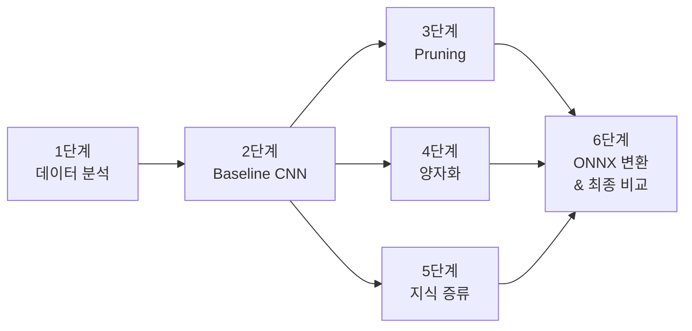

# 배터리 이상 탐지 기술 경량화 — 프로젝트 전체 계획

## 전체 흐름도



---

## 단계별 상세 계획

| 단계 | 목표 | 주요 작업 | 도구 | 실행 환경 | 산출물 | 예상 시간 |
|:----:|------|----------|------|:---------:|--------|:---------:|
| **1** | **데이터 분석 및 전처리** | npy 로드, 분포 확인, 정규화, Train/Val 분할 | NumPy, Matplotlib | 💻 노트북 | 데이터 분석 리포트, 전처리 코드 | 1일 |
| **2** | **Baseline 1D CNN 학습** | 3-Block CNN 모델 설계 및 학습, 성능 측정 | PyTorch | 💻 노트북 (샘플) / ☁️ Colab (원본) | `best_model.pt`, 정확도/F1 기록 | 1~2일 |
| **3** | **Pruning (가지치기)** | 학습된 모델의 필터/가중치 제거 → 재학습(Fine-tune) | `torch.nn.utils.prune` | 💻 노트북 | 압축된 모델, 크기 비교표 | 1일 |
| **4** | **양자화 (INT8)** | FP32 → INT8 변환 (Post-Training Quantization) | `torch.quantization` | 💻 노트북 | 양자화 모델, 속도 비교표 | 0.5일 |
| **5** | **지식 증류** | Teacher(큰 CNN) → Student(작은 CNN) 증류 학습 | PyTorch | ☁️ Colab GPU | Student 모델, 성능 비교표 | 1~2일 |
| **6** | **ONNX 변환 & 최종 비교** | 최종 모델 ONNX 변환 + 전 기법 통합 비교표 작성 | ONNX, ONNX Runtime | 💻 노트북 | `.onnx` 파일, 최종 비교 보고서 | 0.5일 |

---

## 최종 비교표 (보고서 핵심 — 6단계에서 작성)

| 모델 | 정확도 | 모델 크기 | 추론 시간 | 비고 |
|------|:------:|:---------:|:---------:|------|
| Baseline CNN (FP32) | — | — | — | 기준 모델 |
| + Pruning (50%) | — | ↓ | ↓ | 불필요 가중치 제거 |
| + INT8 양자화 | — | ↓↓ | ↓↓ | 정밀도 축소 |
| Student (지식 증류) | — | ↓↓↓ | ↓↓↓ | 경량 모델로 대체 |
| Student + ONNX | — | ↓↓↓ | ↓↓↓↓ | 최종 배포 모델 |

> [!TIP]
> 이 표의 `—` 칸을 실험 결과로 채워가는 것이 프로젝트의 핵심 산출물입니다.

---

## 일정 요약 (총 약 5~7일)

```
Week 1: 1단계(데이터) + 2단계(Baseline) + 3단계(Pruning)
Week 2: 4단계(양자화) + 5단계(지식증류) + 6단계(ONNX & 보고서)
```
