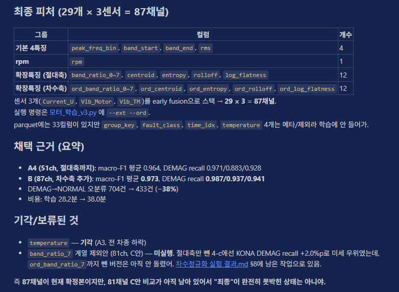

# 방학 - 4주차

날짜: August 15, 2026

# 생각나는거

- 라즈베리파이
- 속도 개선
- 대시보드
- 배경지식 정리

# 속도개선

- 지금 피처가 너무 많아서 느려졌음.
- 성능을 유지하면서 빠르게 만들 방법을 고민해야함




| 기본 4특징 | peak_freq_bin, band_strat, band_end, rms | 4 |
| --- | --- | --- |
|  rpm | rpm | 1 |
| 확장특징(절대축) | band_ratio_0~7, centroid, entropy, rolloff, log_flatness | 12 |
| 확장특징(차수축) | ord_band_ratio_0~7, ord_centroid, ord_entropy, ord_rolloff, ord_log_flatness | 12 |

| 채널수 | 피처 | marco-F1 | DEMAG  recall (IONIQ/KONA/NIRO) | 지연(배치32) (ms) |
| --- | --- | --- | --- | --- |
| 4채널 | 기본 4특징 |  |  |  |
| 15채널(5*3) | 기본 4특징 + RPM | 0.870 | 0.813/0.759/0.770 | 9.5 |
| 48채널(16*3) | 기본 4 + RPM + 절대축 11 | 0.965 | 0.974/0.903/0.927 | 20.2 |
| 51채녈(17*3) | 기본 4 + RPM + 절대축 12 | 0.964 | 0.971/0.883/0.928 | 21.5 |
| 51채녈(17*3) | 기본 4 + RPM + 상대축 12 | 0.9635 | 0.9225 | 21.3 |
| 81채녈(27*3) | 기본 4 + RPM + 절대축 11 + 상대축 11  | 0.972 | 0.983/0.931/0.940 | 33.4 |
| 87채널(29*3) | 기본 4 + RPM + 절대축 12 + 상대축 12  | 0.973 | 0.987/0.937/0.941 | 35.4 |

```
# 새로운 51채널(기본4 + RPM + 상대축12) 돌리는 코드:

python 모터_학습_v3.py --data "...\특징데이터" --out "...\모델_ord_only" --ext --ord --drop band_ratio_0,band_ratio_1,band_ratio_2,band_ratio_3,band_ratio_4,band_ratio_5,band_ratio_6,band_ratio_7,centroid,entropy,rolloff,log_flatness

```

[학습리포트_fuse_rpm_ext_no_band_ratio_7_no_ord_band_ratio_7.txt](%ED%95%99%EC%8A%B5%EB%A6%AC%ED%8F%AC%ED%8A%B8_fuse_rpm_ext_no_band_ratio_7_no_ord_band_ratio_7.txt)

피쳐 선택의 근거 → 가로는 피쳐 세로는 속도 + 정확도 최적점을 찾기

정확도와 속도의 트레이드오프 그래프

---


**커널 축소가 먼저인 이유**가 이거야. 정보를 안 버리면서 속도를 얻는 쪽이니까 밑져야 본전이고, 여기서 목표를 달성하면 채널을 깎을 필요 자체가 없어져

|  | 채널 축소 | 커널 축소 |
| --- | --- | --- |
| 뭘 줄이나 | 입력 정보량 | 계산 반복 횟수 |
| 바꾸는 것 | `FEATURE_COLS` | `NUM_KERNELS` |
| 정확도 손실 | 있음 (0.955 → 0.935) | 작을 것으로 예상 |
| 특징 추출 비용 | 같이 줄어듦 | 안 줄어듦 |

---

# 하드웨어랑 비슷하게 측정하는 방법?

**1. 커널 수별 성능 가격표 (제일 유용, PC로 지금 가능)**

커널 10000 / 5000 / 2000 / 1000으로 각각 학습해서 macro-F1과 DEMAG recall 기록. 4번 돌리면 반나절이야. Pi 도착하는 순간 측정값 보고 최적점을 바로 고를 수 있고, 이 표 자체가 **"성능-속도 트레이드오프 곡선"**이라는 발표 자료가 돼. 경량화 프로젝트에서 이런 곡선은 그 자체로 결과물이야.

**2. PC에서 latency 측정 프로토콜 완성**

Pi에서 돌릴 스크립트를 미리 PC에서 만들고 검증해둬. 웜업 5회 → 100회 반복 → 중앙값/p95, transform과 predict 분리 측정, 메모리 피크 기록까지. 그리고 **PC 기준값을 먼저 확보**해두면 나중에 "PC 대비 Pi가 몇 배"라는 비교표가 자동으로 나와. 층1 검증용 `(입력 100개, PC 예측 확률)` npz도 지금 만들어두면 돼.

**3. 1코어 제한 실험 (Pi 흉내내기)**

PC에서 `taskset -c 0`으로 1코어만 써서 돌려보면 Pi 환경을 거칠게나마 흉내낼 수 있어. 절대값은 못 믿지만 "코어 수에 얼마나 비례하는지"를 알면 Pi 예측 정확도가 올라가.

